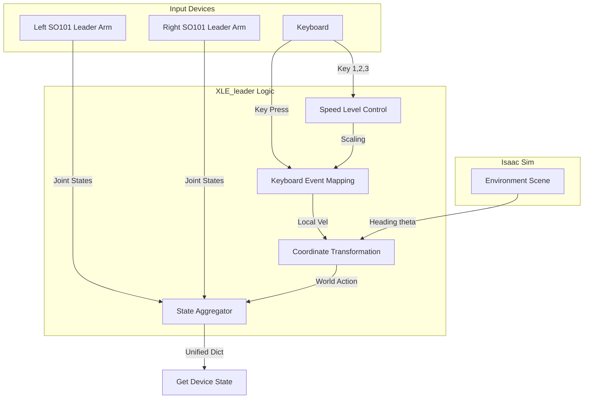

<!-- # XLE_leader Block Diagram

This diagram illustrates how `xle_leader.py` handles input from the keyboard and physical SO101 leader arms, performs coordinate transformations, and aggregates them for the Isaac Lab environment. -->

